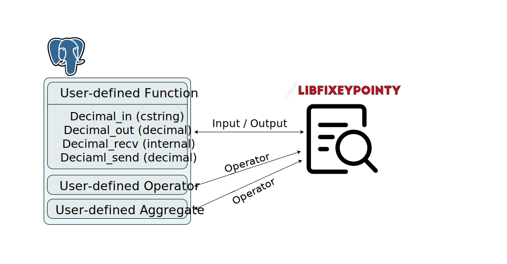

# Fast Fixed-Point Decimals

## Overview

Database management systems commonly support both floating-point and fixed-point values for storing decimals.
Fixed-point data types in database management systems give predictable results but are commonly slower than floating-point data types.
However, with bit-wise techniques, fixed-point data types can improve their performance significantly.

Our project is to study how fast fixed-point data types are after applying bit-wise techniques in database management systems, PostgreSQL.
More importantly, our project also explores possibilities to make fixed-point data types even faster than floating-point data types.

Since there is an existing open-source project, `libfixeypointy`, we would like to utilize, validate, evaluate, and document the project code.
GMP is used to evaluate the performance of the project.
Accordingly, our project integrates the project with PostgreSQL, a well-known relational database management systems, as a user-defined type.
Our project evaluates the user-defined type to understand the performance after integration against PostgreSQL's built-in `DECIMAL`, which is their fixed-point data type. Furthermore, our project evaluates the user-defined type against PostgreSQL's built-in `REAL`, which is their floating-point data type, to understand a performance gap between fixed-point with bit-wise techniques and floating-point data types in databases.

## Scope

### Libfixeypointy:
- Overflow checks will be added.
- Verification tests will be added to cross-check Libfixeypointy results with the following libraries:
    - Python: decimal
    - Java: math.BigDecimal
- Benchmark tests will be added to compare Libfixeypointy with:
    - Python decimal
    - GMP floating point (mpf)
- Performance enhancements will be added if applicable.

### Postgres Extension:
- A Postgres extension will be implemented to port Libfixeypointy into Postgres as a user-defined type.
- Boundary conditions (e.g., overflows) will be caught and handled.
- Verification tests will be added to check the porting effort does not introduce new bugs.
- Benchmark tests will be added to compare the performance of our UDT with: 
    - Postgres builtin NUMERIC type
    - Postgres builtin floating point type

## Architectural Design

Our project supports libfixeypointy as PostgreSQL's UDT. UDT is implemented in C++ language, our type is defined as Decimal, and the role of each function is as follows. Since libfixeypointy uses 128 bits of information, decimal in our definition uses a fixed size of 128 bits.

- decimal_in(cstring): Convert cstring parameter to decimal and return it.

- decimal_out(decimal): Converts the value of the decimal parameter to a string type and returns it.

- decimal_recv(internal): It receives a message based on the address of the buffer, converts it to decimal type, and returns a pointer.

- decimal_send(decimal): Transmits the value of the decimal parameter in the form of a buffer pointer.

Our Decimal type supports four arithmetic and comparison operators as shown below, and also supports Aggregates.

- \+, \-, \*, /, =, <>, !=, <, <=, >, >=, 

## Design Rationale

The goal of our design is to support fixed-point Decimals in PostgreSQL, optimizing performance in decimal arithmetic. In the form of UDTs in PostgreSQL, we port the libfixeypointy library implemented by referring to Hacker's Delight.

PostgreSQL supports UDTs, which allow users to define and benchmark new types. Although some databases such as Microsoft SQL Server and MongoDB support user-defined data types, we chose PostgreSQL for the following reasons. 

- Integrates with other features that support UDTs
    - PostgreSQL is well integrated with other features that use UDTs. For example, PostgreSQL can handle UDTs using user-defined operators, indexes, functions, procedures, etc.

- Extensible
    - PostgreSQL is highly extensible and flexible in adding new features. This allows users to create their own UDTs and use them in PostgreSQL. It is stored in the same way as the existing data format, so there are no performance issues when using UDTs.

- Comparison with existing formats
    - it can be compared with the decimal arithmetic already defined as NUMERIC in PostgreSQL

## Testing Plan

### Libfixeypointy:
- A C++ driver program will be implemented to read from input test sequence, perform all operations, recording all intermediate results (inclusing errors), and write to output file for comparison.
- A Python driver program will be implemented with the native decimal class to read from input test sequence, perform all operations, recording all intermediate results (including errors), and write to output file for comparison.
- A Java driver program will be implemented with math.BigDecimal to read from input test sequence, perform all operations, recording all intermediate results (including errors), and write to output file for comparison.
- Test generators will be written in python and/or Java to generate operation chains suitable for their corresponding decimal libraries.

### Postgres Extension:
- A Python generator will be written to generate insertable data into Postgres with column type as our UDT. Test queries of the following form will be added:
    - colA op colB
    - SUM(colA)
- All tests will be verified with a 4-way comparison between:
    - Reference results generated by running the test with Python decimal 
    - Reference results generated by running the test with Java BigDecimal
    - Results generated from Postgres using NUMERIC as the column type
    - Results generated from Postgres using our UDT as the column type

## Trade-offs and Potential Problems

- Design of benchmark does not cover all potential edge cases

## Future Work

The following list are the potential future work we think there are interesting to be explored.
- Improve `libfixeypointey` performance based on existing techniques in existing high-performance packages
- Vectorization support
